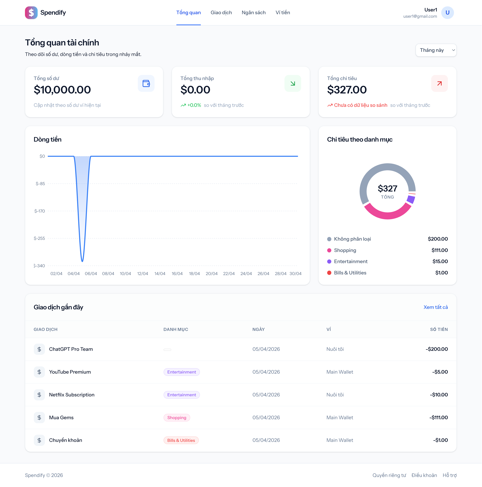
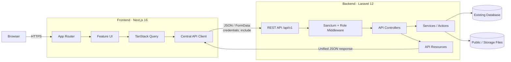
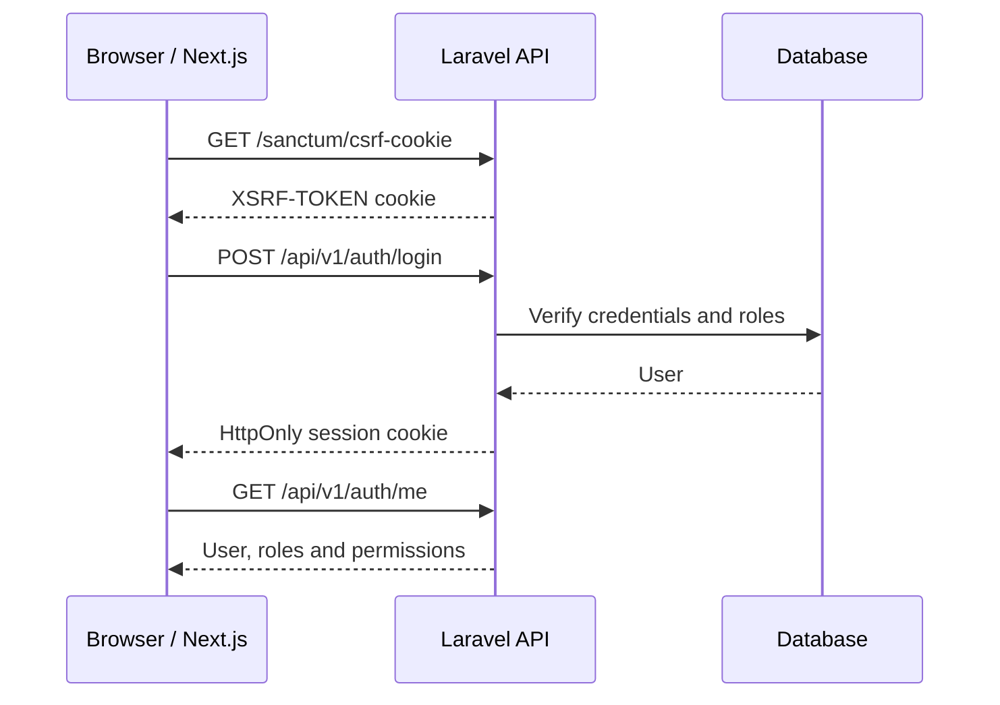
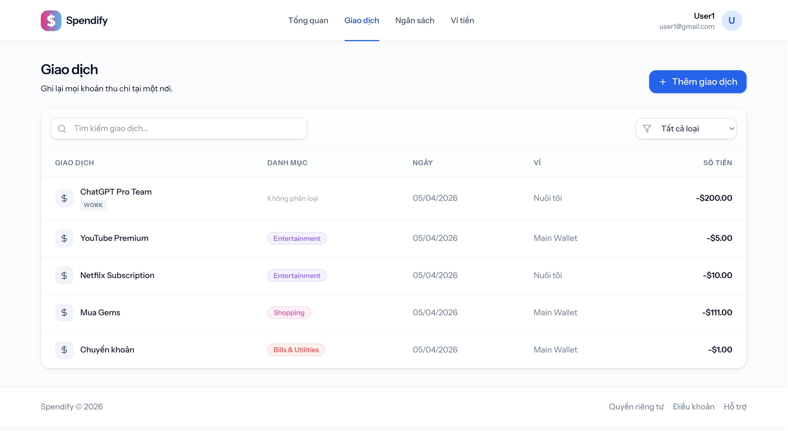
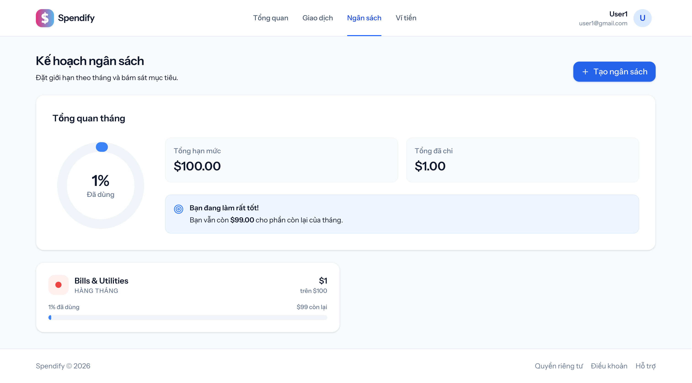
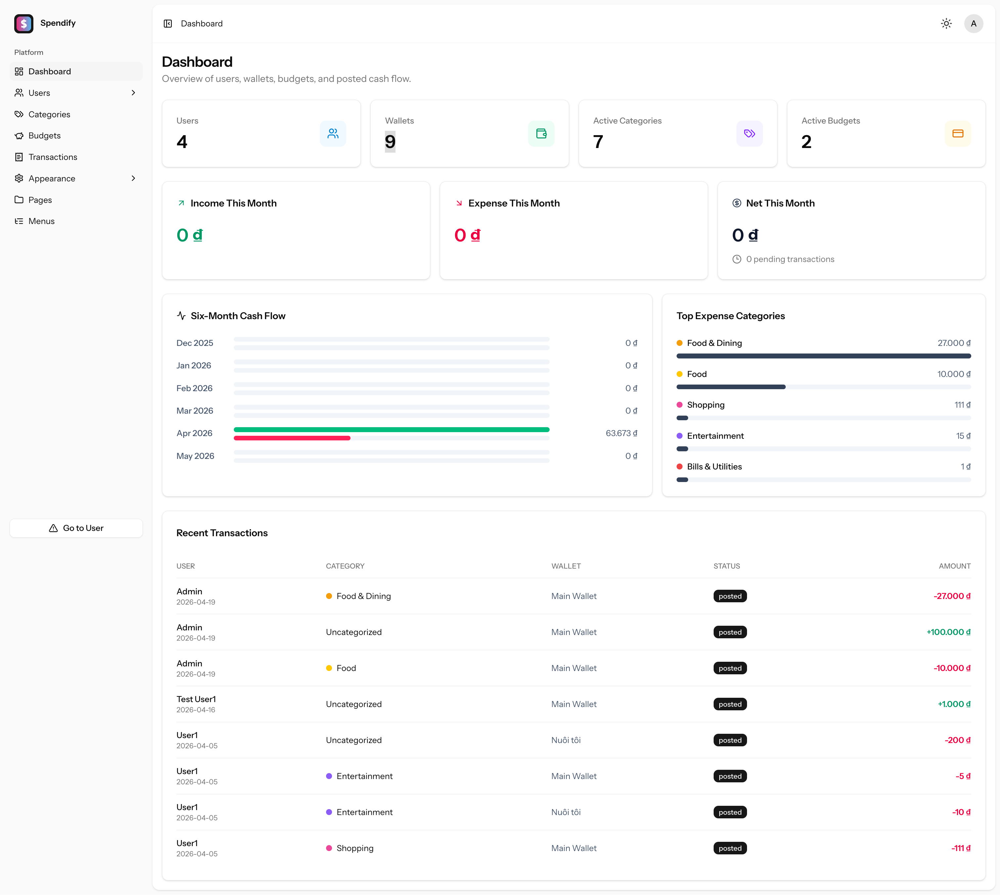
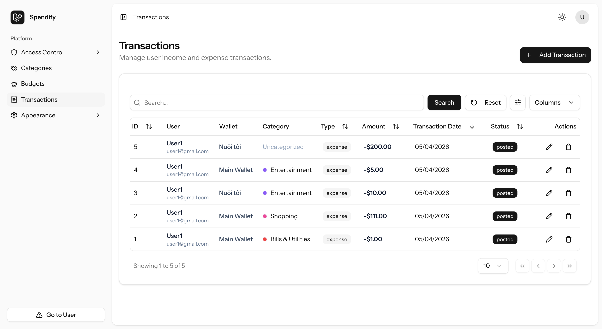
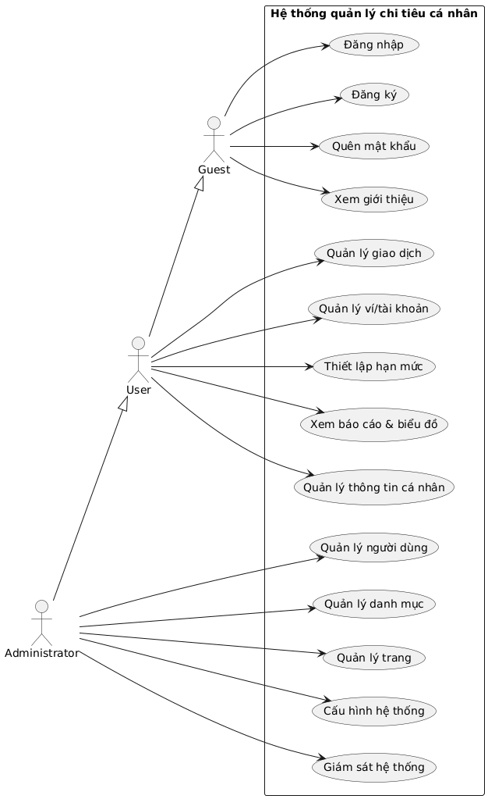

<div align="center">

# Spendify

### Personal finance management platform

Ứng dụng quản lý thu chi cá nhân với Laravel REST API và Next.js, hỗ trợ dashboard tài chính, ví tiền, giao dịch, ngân sách và hệ thống quản trị phân quyền.

[](backend/composer.json)
[](frontend/package.json)
[](frontend/package.json)
[](frontend/tsconfig.json)
[](backend/routes/api.php)
[](backend/config/sanctum.php)

[Tổng quan](#tổng-quan) ·
[Kiến trúc](#kiến-trúc-hệ-thống) ·
[Tính năng](#tính-năng-chính) ·
[Cài đặt](#cài-đặt-và-chạy-local) ·
[API](#api-overview) ·
[Tài liệu](#tài-liệu-dự-án)

</div>



## Tổng quan

Spendify giúp người dùng theo dõi dòng tiền, quản lý ví, phân loại giao dịch và kiểm soát ngân sách. Hệ thống đồng thời cung cấp khu vực quản trị để quản lý người dùng, phân quyền, dữ liệu tài chính và nội dung website.

Repository đã được tách thành hai ứng dụng độc lập:

```text
cashback/
├── backend/                 Laravel 12 REST API
├── frontend/                Next.js 16 application
├── docs/
│   ├── images/              Hình ảnh dùng trong tài liệu repository
│   └── srs.docx             Software Requirements Specification
├── MIGRATION.md             Báo cáo migration Inertia → REST API + Next.js
└── README.md
```

| Thành phần | Vai trò | Chạy local |
|---|---|---|
| `backend/` | REST API, authentication, authorization, business logic, database và upload | `http://localhost:8000` |
| `frontend/` | Giao diện Next.js App Router, data fetching và client state | `http://localhost:3001` |
| API v1 | Giao tiếp duy nhất giữa frontend và backend | `http://localhost:8000/api/v1` |

## Kiến trúc hệ thống



### Nguyên tắc tách hệ thống

- Frontend và backend chạy, build và deploy độc lập.
- Frontend không import route, view hoặc component từ Laravel.
- Toàn bộ dữ liệu đi qua REST API có prefix `/api/v1`.
- Authentication dùng Laravel Sanctum SPA cookie và CSRF protection.
- Access token nhạy cảm không được lưu trong `localStorage`.
- Backend kiểm tra quyền bằng middleware, Gate và Policy; frontend chỉ điều chỉnh trải nghiệm hiển thị.
- API call được tập trung trong `frontend/src/lib/api` và `frontend/src/services`.

### Authentication flow



## Công nghệ sử dụng

| Layer | Công nghệ |
|---|---|
| Backend | PHP 8.2+, Laravel 12, Laravel Sanctum, Laravel Fortify |
| Authorization | Policies, Gates, middleware và Spatie Laravel Permission |
| API | Versioned REST API, Form Request, API Resource, Service classes |
| Frontend | Next.js 16, React 19, App Router, TypeScript |
| UI | Tailwind CSS 4, Lucide Icons, responsive layout |
| Data fetching | TanStack Query và API client tập trung |
| Form | React Hook Form và Zod |
| Testing | Pest 4, Vitest, Testing Library, ESLint và TypeScript |

## Tính năng chính

| Nhóm | Chức năng |
|---|---|
| Public | Landing page, nội dung public theo slug, cấu hình thương hiệu |
| Authentication | Đăng ký, đăng nhập, đăng xuất, quên/reset mật khẩu, two-factor challenge |
| Dashboard | Tổng số dư, thu nhập, chi tiêu, dòng tiền và phân bổ theo danh mục |
| Wallets | Tạo, cập nhật, xóa và theo dõi số dư ví |
| Transactions | Thu/chi, danh mục, nhãn, tìm kiếm, lọc, sắp xếp và phân trang |
| Budgets | Hạn mức theo danh mục, chu kỳ tháng/năm và tiến độ chi tiêu |
| User settings | Hồ sơ cá nhân và tùy chọn người dùng |
| Admin | Dashboard tổng hợp, Users, Roles, Permissions, Categories, Transactions và Budgets |
| Content management | Pages, Menus và Appearance đa ngôn ngữ |

## Giao diện

### Người dùng

<table>
  <tr>
    <td width="50%">
      
      <p align="center"><strong>Quản lý giao dịch</strong></p>
    </td>
    <td width="50%">
      
      <p align="center"><strong>Kế hoạch ngân sách</strong></p>
    </td>
  </tr>
</table>

### Quản trị viên





<details>
<summary><strong>Xem sơ đồ use case nghiệp vụ</strong></summary>

<p align="center">
  
</p>

</details>

## Cài đặt và chạy local

### Yêu cầu

- PHP `>= 8.2` — môi trường phát triển hiện tại sử dụng PHP `8.4`.
- Composer `2.x`.
- Node.js `>= 20.9.0`.
- npm.
- SQLite, MySQL hoặc database tương thích với Laravel.

### 1. Clone repository

```bash
git clone https://github.com/nqkha06/spendify.git
cd spendify
```

### 2. Cài đặt backend

```bash
cd backend
composer install
cp .env.example .env
php artisan key:generate
```

Cấu hình database trong `backend/.env`, sau đó chạy:

```bash
php artisan migrate --seed
php artisan serve --host=127.0.0.1 --port=8000
```

### 3. Cài đặt frontend

Mở terminal khác:

```bash
cd frontend
npm install
cp .env.example .env.local
npm run dev
```

Truy cập:

- Frontend: <http://localhost:3001>
- Backend API: <http://localhost:8000/api/v1>

## Cấu hình môi trường

### Backend

```env
APP_URL=http://localhost:8000
FRONTEND_URL=http://localhost:3001

SESSION_DRIVER=database
SESSION_DOMAIN=localhost
SESSION_COOKIE=laravel_session
SESSION_SECURE_COOKIE=false
SESSION_SAME_SITE=lax

SANCTUM_STATEFUL_DOMAINS=localhost,localhost:3001
```

### Frontend

```env
NEXT_PUBLIC_API_URL=http://localhost:8000/api/v1
NEXT_PUBLIC_BACKEND_URL=http://localhost:8000
LARAVEL_SESSION_COOKIE=laravel_session
```

Không hard-code domain trong source code. Khi deploy, cần cập nhật đồng bộ `FRONTEND_URL`, CORS, `SANCTUM_STATEFUL_DOMAINS`, `SESSION_DOMAIN` và HTTPS cookie.

## API overview

Backend hiện cung cấp `74` route API dưới prefix `/api/v1`.

| Scope | Endpoint tiêu biểu |
|---|---|
| Public | `GET /public/configuration`, `GET /public/pages/{slug}` |
| Authentication | `POST /auth/login`, `POST /auth/register`, `POST /auth/logout`, `GET /auth/me` |
| User dashboard | `GET /user/dashboard` |
| User finance | `/user/wallets`, `/user/transactions`, `/user/budgets`, `/user/categories` |
| User settings | `GET /user/settings`, `PATCH /user/settings/profile`, `PATCH /user/settings/preferences` |
| Admin access control | `/admin/users`, `/admin/roles`, `/admin/permissions` |
| Admin finance | `/admin/categories`, `/admin/transactions`, `/admin/budgets` |
| Admin content | `/admin/pages`, `/admin/menus`, `GET/POST /admin/appearance` |

Response thành công:

```json
{
  "success": true,
  "message": "Operation completed successfully",
  "data": {}
}
```

Response lỗi:

```json
{
  "success": false,
  "message": "Validation failed",
  "errors": {}
}
```

## Kiểm thử và quality gates

### Backend

```bash
cd backend
php artisan test --compact
vendor/bin/pint --format agent
```

### Frontend

```bash
cd frontend
npm run lint
npm run typecheck
npm test
npm run build
```

Baseline gần nhất:

| Suite | Kết quả |
|---|---|
| Laravel/Pest | `77 passed` · `476 assertions` |
| Next.js/Vitest | `44 passed` |
| ESLint | Passed |
| TypeScript | Passed |
| Next.js production build | Passed |

## Deployment

Kiến trúc hỗ trợ triển khai trên hai domain độc lập:

```text
Frontend:    https://example.com
Backend API: https://api.example.com
```

Checklist production:

- Bật HTTPS cho cả frontend và API.
- Đặt `APP_ENV=production` và `APP_DEBUG=false`.
- Cấu hình CORS chỉ cho phép frontend production.
- Cấu hình Sanctum stateful domains và session cookie domain phù hợp.
- Bật secure cookie.
- Chạy database migration, queue worker và storage/public file strategy.
- Build frontend bằng `npm run build` và chạy độc lập với Laravel.

---

<div align="center">

**Spendify** · Laravel REST API + Next.js

</div>
